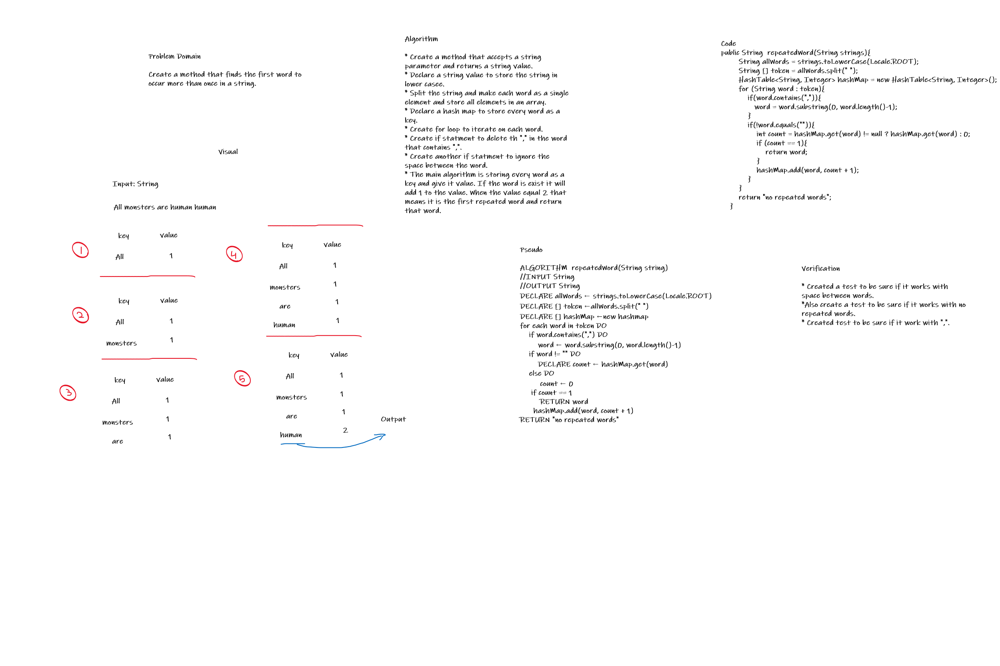
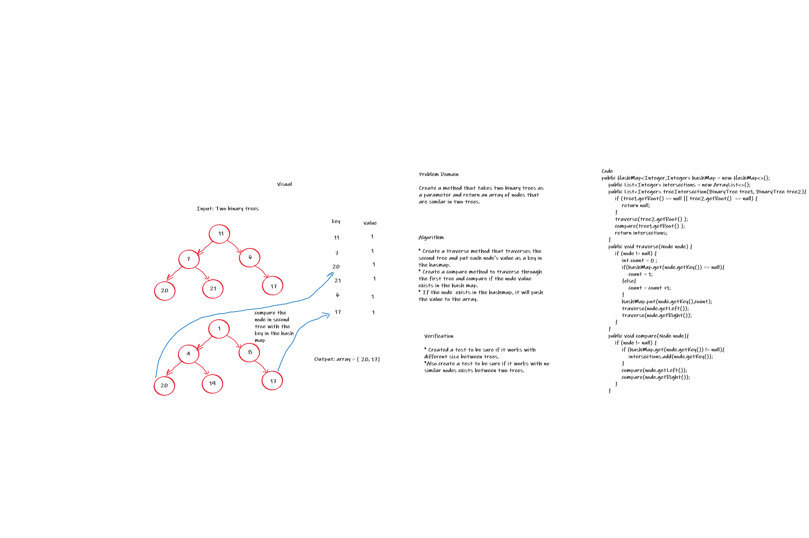
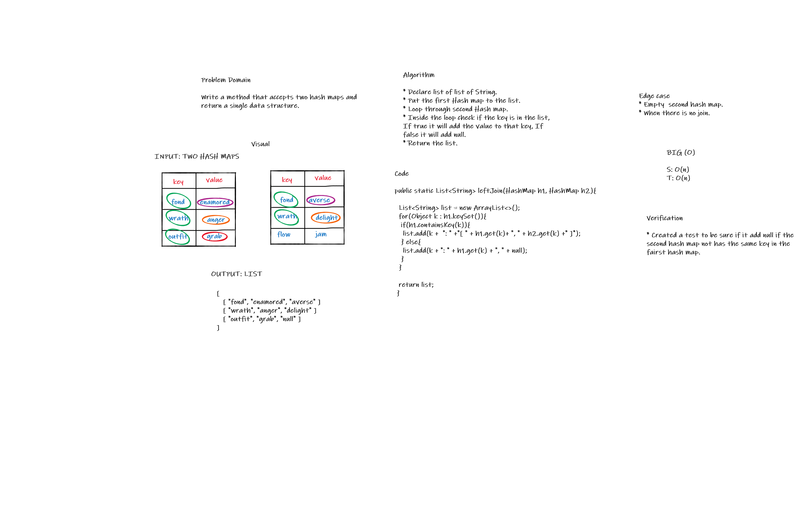

# Hash Table Implementation

A hash table is a data structure and it is an array of list. Each list is known as a bucket. The position of the bucket is identified by calling the hashcode() method

## Challenge

Implement a Hashtable Clas

## API

* `add(K key, V value)`: add the key and value pair to the table.

* `get(K key)`: Returns value associated with that key in the table

* `contains`: Returns boolean, indicating if the key exists in the table already.

* `remove(K key)`: remove the value from the table based on the key.

* `isEmpty()`: check the hash table is empty or not.

# hashmap-repeated-word CC31

Write a function that accepted a string parameter which  finds the first word to occur more than once in a string and return a string.

## Whiteboard Process

# hashmap-tree-intersection CC32

Create a method that takes two binary trees as a parameter and return an array of nodes that are similar in two trees.

## Whiteboard Process

# Hashmap LEFT JOIN CC33

Implement a simplified LEFT JOIN for 2 Hashmaps.

## Challenge

Write a method called `leftJoin` accepts two hash maps as a parameters and return a single data structure. It will add the first hash map to the list and then loop through second hash map to check if the key is in the list, if it exist in the list it will add the value of the key to the same key in the list.

## Whiteboard

## Approach and Efficiency

* Time: O(n)

* Space: O(n)

# hashmap-repeated-word CC34

Write a function that accepted a string parameter which  finds the first word to occur more than once in a string and return a string.

## Whiteboard Process

