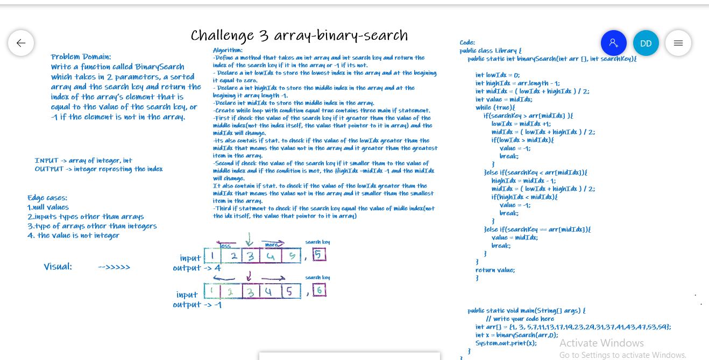

# Challenge 2 array-insert-shift

# Array binary search

Create a method that take 2 parameters (int array and int searchKey) and return the index of the array's element that is equal to the value of the search key, or -1 if the element is not in the array.

## Whiteboard Process

## Approach & Efficiency

Apply the binary search concept to search specific values in the array. The binary search is faster than the linear search because it takes less iteration than the linear search.