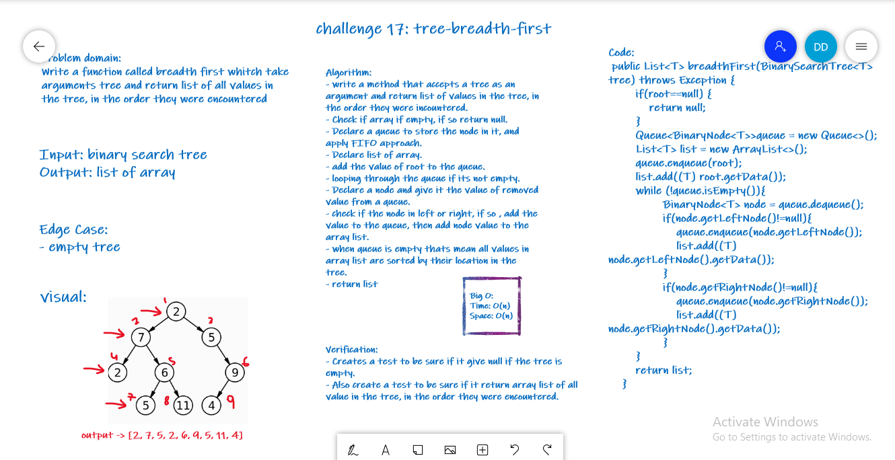
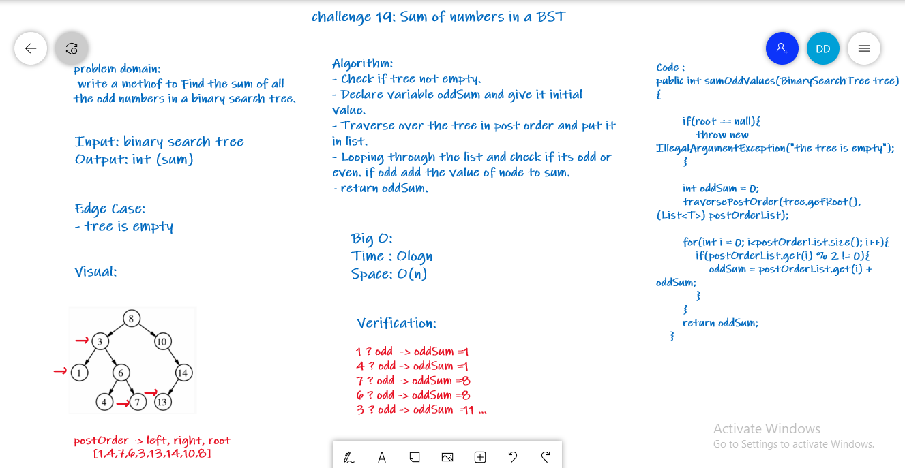

# Trees

<!-- Short summary or background information -->

Trees are a data structure that made of nodes, each node has its own maximum number of children nodes which is K.

Binary search trees are rooted binary trees data structure which internal nodes each store a key greater than all the keys in the node’s left subtree and less than those in its right subtree.

## Challenge 15

<!-- Description of the challenge -->

New Implementations :

- Nodes
- Binary Trees
- Binary Search Trees

## Approach & Efficiency

<!-- What approach did you take? Why? What is the Big O space/time for this approach? -->

The approach is simple we compare the node data and add nodes to the tree based on if the data is larger (to the right node) or smaller(to the left node) than the data of the current node

- Time complexity O(log(n))
- Space O(1)

## API

<!-- Description of each method publicly available in each of your trees -->

- BinarySearchTree.Add() => This api is used to add a new node to the tree in the correct location

- BinarySearchTree.Contain() => This api is used to search for data inside the tree and returns a boolean indicating whether the data is in the tree or not.

# Challenge 16 : To find the maximum value in the tree

## Whiteboard Process

## Approach & Efficiency
Implemented a max method that returns an integer, Saved the traversed data into a list and loop through the list and find
the maximum value and return it.

Space O(n)
Time O(n)

## Solution
- Make an object of the Binary Tree and add elements to it.
- Call the max method to find the maximum value in the tree.

# Challenge 17: tree-breadth-first

Write a method that accepts a tree as an argument and return list of all values in the tree, in the order they were encountered.

## Whiteboard Process

# Challenge 19: Sum of odd BST

write a methof to Find the sum of all the odd numbers in a binary search tree.

## Whiteboard Process

challenge19SumOfOddBST.PNG