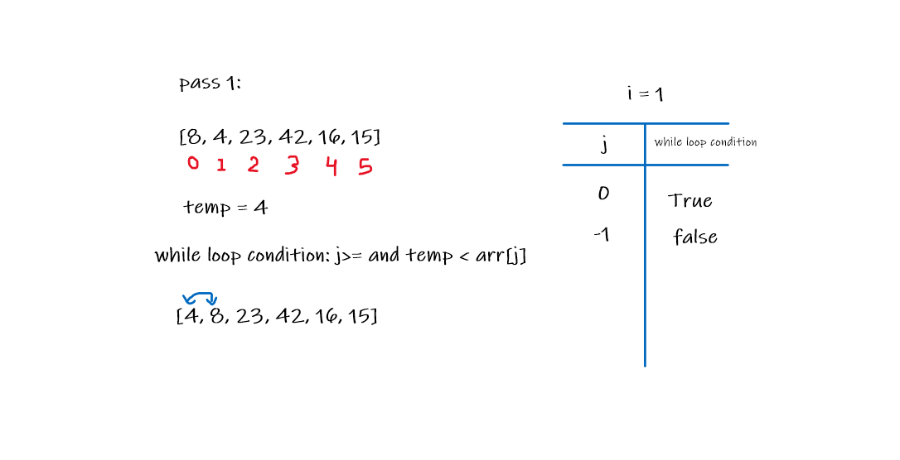
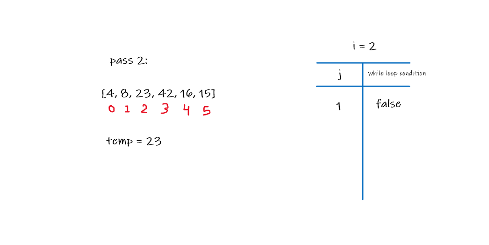
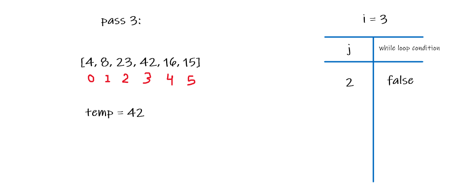
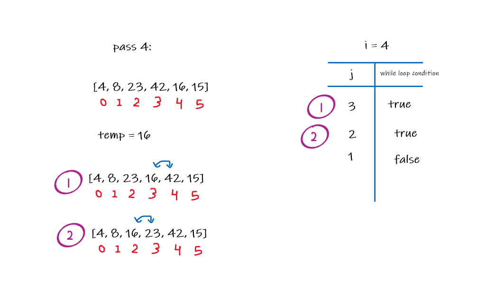
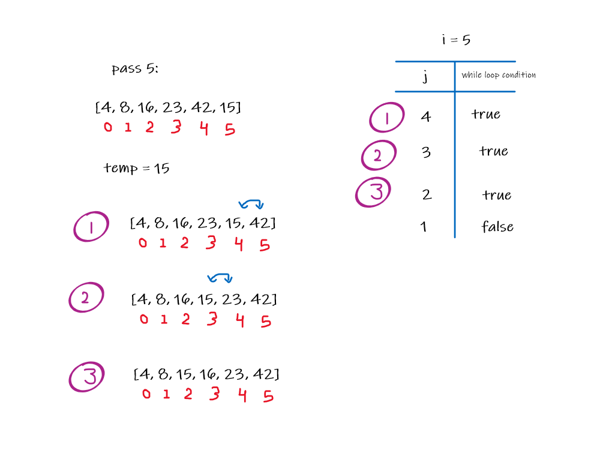

# Insertion Sort

This challenge relates to creating a method called `insartionSort (int [] arr) ` that takes an int array as a parameter. The purpose of this method is to sort an unsorted array in ascending order.

## Pesudocode

```
InsertionSort(int[] arr)

    FOR i = 1 to arr.length

      int j <-- i - 1
      int temp <-- arr[i]

      WHILE j >= 0 AND temp < arr[j]
        arr[j + 1] <-- arr[j]
        j <-- j - 1

      arr[j + 1] <-- temp
```

## The Code

```
public class InsertionSort {

    public void insertionSort(int [] arr){

        for(int i = 1; i < arr.length; i++){
            int j = i - 1;
            int temp = arr[i];
            while (j >= 0 && temp < arr[j]){
                arr[j+1] = arr[j];
                j = j - 1;
            }
            arr[j + 1] = temp;

        }
    }
}
```

## Trace

* Example Array: [8, 4, 23, 42, 16, 15]

### Pass 1:



* The method will start from i = 1 until the length of the arry, and inside the for loop, there is a `int j` and its value is `i - 1 ` and also the is a `temp` and its value `arr[i]`. The while loop will check if the temp value is greater or smaller than the previous value. If it smaller it will swap between the values.

* In the first Iteration the 4 value is smaller than 8 value so it will swap between the two values.

### Pass 2:



* Here the temp value will be 23 and it is greater than 8 so there is no change.

### Pass 3:



* Here The temp value will be 42 and also it is greater than 23 so there is no change.

### Pass 4:



* Here the temp value will be 16. This stage will be in two steps. The first step will swap between 16 and 42 and the second step will swap between 16 and 23.

### Pass 5:



* Here the temp value will be 15. This stage will be in three steps. The first step will swap between 15 and 42 and the second step it will swap between 15 and 23 and the last step it will swap between 15 and 16.