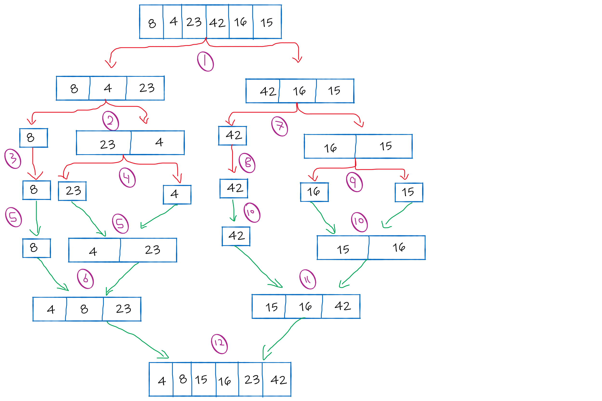

# Merge Sort

This challenge relates to creating a method called `mergeSort (int [] arr) ` that takes an int array as a parameter. The method divides the array into two parts and each part is also divided into two parts until breaking each element into a single part.

Then sort the elements from smallest to largest and merge the divided sorted array together. In the end, the array has been sorted.

## Pesudocode

```
ALGORITHM Mergesort(arr)
    DECLARE n <-- arr.length

    if n > 1
      DECLARE mid <-- n/2
      DECLARE left <-- arr[0...mid]
      DECLARE right <-- arr[mid...n]
      // sort the left side
      Mergesort(left)
      // sort the right side
      Mergesort(right)
      // merge the sorted left and right sides together
      Merge(left, right, arr)

ALGORITHM Merge(left, right, arr)
    DECLARE i <-- 0
    DECLARE j <-- 0
    DECLARE k <-- 0

    while i < left.length && j < right.length
        if left[i] <= right[j]
            arr[k] <-- left[i]
            i <-- i + 1
        else
            arr[k] <-- right[j]
            j <-- j + 1

        k <-- k + 1

    if i = left.length
       set remaining entries in arr to remaining values in right
    else
       set remaining entries in arr to remaining values in left
```

## The Code

```
public class MergeSort {

    public static void mergeSort(int[] arr){
        int step = 1;
        int n = arr.length;
        if (n < 2){
            return;
        }

        int mid = n/2;
        int[] left = new int[mid];
        int[] right = new int[n - mid];

        for (int i = 0; i < mid; i++){
            left[i] = arr[i];
        }

        step ++;

        for (int i = mid; i < n; i++){
            right[i-mid] = arr[i];
        }
        step ++;
        mergeSort(left);
        mergeSort(right);

        merge(arr,left,right);
    }

    public static void merge(int[] arr,int[] left,int[] right){
        int i = 0, j = 0, k = 0;
        while (i < left.length && j < right.length){
            if (left[i] < right[j]){
                arr[k++] = left[i++];
            }else {
                arr[k++] = right[j++];
            }
        }
        while (i < left.length){
            arr[k++] = left[i++];
        }
        while (j < right.length){
            arr[k++] = right[j++];
        }
    }
}
```

## Trace

Example Array: [8, 4, 23, 42, 16, 15]

